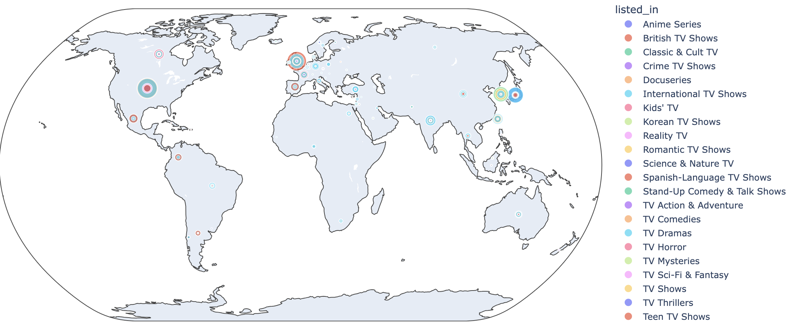

# py-netflix-tv-movies
Data analysis in python

# Visualizations
On this section I will create the charts to better understanding of the dataset we have. Due to the data we have, I will need  
to separate the tv shows and movies. Why? The duration are different in both of them, movies durations are in minutes and tv shows in seasons

### Both of them
* Donut chart: Comparision of how much of the are in the catalog. ✅
* Stacked bar chart with the country and the type. Or maybe map chart, with both of the types added. ✅
* Line chart: Will show which of them are more important to netflix. ✅

### TV Shows
* Word Cloud for listed_in ❌
* Graph by listed_in with filter ✅
* Map of heat for the Tv Shows. This will be important to see which countries are important to netflix catalog.❌
* Bar chart of the tv shows where are listed in and the country. ✅
* Sankey Diagram with country and listed_in. ❌
* Line chart of the listed_in during all the years. Sankey diagram✅
* Donut chart with the missing data: Country, listed_in❌
* Avg time from the release of the show and date added to netflix✅

### Movies
* Word Cloud for listed_in
* Map of heat for the Tv Shows. This will be important to see which countries are important to netflix catalog.
* Bar chart of the countries with most movie catalog added by year.
* Sankey Diagram with country and listed_in
* Line chart of the listed_in during all the years.
* Donut chart with the missing data: Country, listed_in
* Avg time from the release of the movie and date added to netflix

### Summary
Summary of the data we retrived via the charts.

### Optional: 
Seek the anime movies and tv shows. And if it's going up by the years.Like in the previous steps, we will separate the tv shows and movies.

* Bar chart with the top 5 countries with most anime added. (Probably these are the countries who wants to watch more anime)
* Top director.
* Donut chart of the rating.
* Line chart to see the trend.

### Notes:
* I had plans to use this visualization by plotly in the are TV Show and Movies, but as we can see it, we couldn't see anything. 

##Libraries:
* Dash
* nbformat
* plotly 
* pandas
* seaborn
* matplotlib

### Result Netflix catalog 2008/01-2021/09:
- The netflix catalog contains:
    - Movies: 69.6%
    - Tv Shows: 30.4%
- Average time to be added to the netflix catalog:
    - Movies: 6.26 Years
    - TV Shows: 2.16 years

### Result analyzing the anime genre in this catalog 2008 to 2021
- The growth of the anime in these years:
- We could have a problem with the time that the users need to wait for the show. Looking to the data, we can see that the average time of the show to be added to netflix is the next:

    
    

    In these time, we are losing a high audience and most important losing against platforms like crunchyroll for example where there you can find simulcast (The anime is listed on the platform as it shows to the Tv/Movie). Obviously the movies are more difficult to be added day 1, but we have a huge problem on the Tv show. The Tv shows takes even 2.5 years more compared to the movie (On average). Reducing these time (Specially on the Tv Shows) will encourage a huge group of users, anime is gaining popularity, and we should jump on the bandwagon.
- The average increase trought these years is 30.92%
    