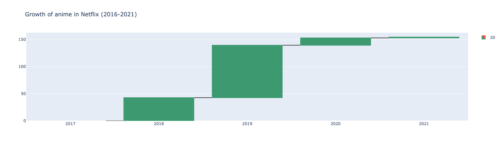
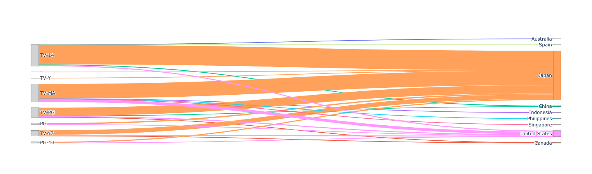

# py-netflix-tv-movies
Data analysis in python

# Visualizations
On this section I will create the charts to better understanding of the dataset we have. Due to the data we have, I will need  
to separate the tv shows and movies. Why? The duration are different in both of them, movies durations are in minutes and tv shows in seasons

# Summary
Summary of the data we retrieved via the charts.

#### Libraries:
* Dash
* nbformat
* plotly 
* pandas
* seaborn
* matplotlib

#### Result Netflix catalog 2008/01-2021/09:
- The netflix catalog contains:
    - Movies: **69.6%**
    - TV Shows: **30.4%**
- Average time between original release and being added to Netflix:
    - Movies: **6.26 years**
    - TV Shows: **2.16 years**

#### Result analyzing the anime genre in this catalog 2008 to 2021
- The average increase for each year trough all the years of the dataset is **30.92**. It's important to realize that **Netflix didn't have any type of anime genre in their catalog till 2016**.
    
    
- We could have a problem with the time that the users need to wait for the show. Looking to the data, we can see that the average time of the show to be added to netflix is the next:

    
    

    This delay is critical for anime fans because platforms like Crunchyroll offer simulcast releases (shows are available on the platform as soon as they air on TV). While movies are harder to license on day one, the current delay for anime TV shows means Netflix is likely losing a highly engaged audience segment. Reducing this time‑to‑catalog, especially for TV shows, would make Netflix more competitive in the anime market, which is currently gaining popularity. 

- Most anime titles are rated TV-MA and TV-14, which indicates that the **catalog is mainly oriented toward teenagers and adults**. For the other hand, we can see that the top 3 countries with most animes in the netflix catalog are: **Japan(200), United States(25) and China(4)**
    

### Notes:
* I had plans to use this visualization by plotly in the are TV Show and Movies, but as we can see it, we couldn't see anything. 
